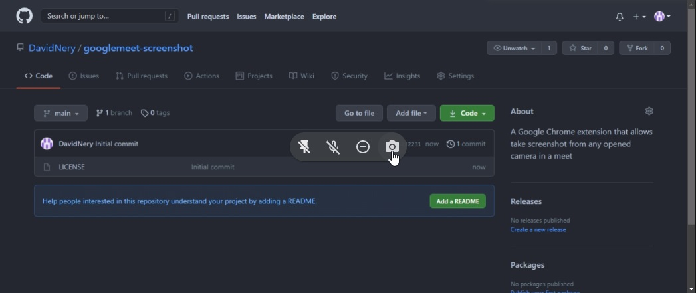

# Meet Screenshot
Meet Screenshot is an extension for Google Chrome that allows users to take screenshots of any participant in a meet with the camera open, including the presentation

## Screenshot

## Contributing
Do you want to contribute with this repository? Follow the steps below:
1. Create a fork of this repository
2. Pull the content from YOUR forked repository
3. Do the things you want
4. Push the commits to Github
5. Create a pull request

## Contributors
| [ @DavidNery](https://github.com/DavidNery) |